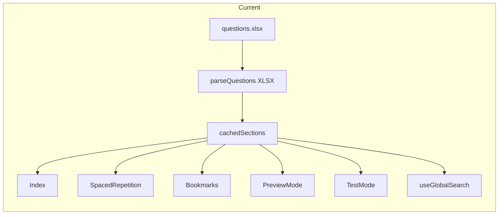

# Questions DB Migration and AI-Ready Question Bank

## Verification checklist (all five requirements)

| #   | Requirement                                                                                                                                               | How the plan ensures it                                                                                                                                                                                                                                                                                                                                                        |
| --- | --------------------------------------------------------------------------------------------------------------------------------------------------------- | ------------------------------------------------------------------------------------------------------------------------------------------------------------------------------------------------------------------------------------------------------------------------------------------------------------------------------------------------------------------------------ |
| 1   | Current Excel → pipeline → DB; no display errors; same parsing so question, choices A–D (selectable), answer, and answer description all render correctly | Import reuses **exactly** the same `stripHtml`, `decodeHtmlEntities`, and category logic as current `parseQuestions`. Stored `question` and `answer` match current Excel output. **Verification step** after import: diff stored vs. current parse output for a sample (or all) rows; fix any mismatch. No UI changes — `QuestionCard` and `parseQuestionForReview` unchanged. |
| 2   | Future Excel files can be added and parsed through the same pipeline                                                                                      | Pipeline is **re-runnable** with a **different file path** (env or CLI). Same Excel format (columns, header rows, layout) required. Upsert adds new rows and updates existing. Optional: extend `categoryMapping` or add sections/subsections for new categories.                                                                                                              |
| 3   | AI agent **constantly** uses DB as **ground truth** to "remix" and generate new questions, using **textbook data** as material                            | DB questions = ground truth for generation. **Textbook/reference** (e.g. provided .docx, reference DB, or existing reference content) is **input** to generation alongside DB questions. **Scheduled generation job** (cron or background worker) runs periodically; design and implement it.                                                                                  |
| 4   | All pages load questions in **current format**, but from the DB                                                                                           | Index, SpacedRepetition, Bookmarks, PreviewMode, TestMode, useGlobalSearch switch to `useSections` / `GET /api/sections`. API returns same `Section[]` / `Question` shape. **No** changes to `QuestionCard`, `parseQuestionForReview`, or choice/answer rendering.                                                                                                             |
| 5   | All user data (answers, correct/incorrect, SR, bookmarks, etc.) still saved correctly                                                                     | Same `questionId`, `sectionId`, `subsectionId`; same APIs and storage for `questionResponses`, `bookmarks`, `spacedRepetitions`, `testSessions`, `highlights`, `notes`. No migration of user data.                                                                                                                                                                             |

---

## Current state

- **Source**: Questions live in `[client/public/data/questions.xlsx](client/public/data/questions.xlsx)`. The client fetches the file and parses it in `[parseQuestions.ts](client/src/utils/parseQuestions.ts)` via XLSX (skip first 12 rows; columns: id, category path, question HTML, answer HTML, tags).
- **Shape**: Parsed into `Section[]` (section → subsections → questions). Section/subsection IDs and titles come from `[createSectionStructure](client/src/utils/parseQuestions.ts)` and `categoryMapping` (e.g. `comprehensive`, `anatomy`).
- **Consumers**: `[Index](client/src/pages/Index.tsx)`, `[SpacedRepetition](client/src/pages/SpacedRepetition.tsx)`, `[Bookmarks](client/src/pages/Bookmarks.tsx)`, `[PreviewMode](client/src/pages/PreviewMode.tsx)`, `[TestMode](client/src/pages/TestMode.tsx)` (for new tests), `[useGlobalSearch](client/src/hooks/useGlobalSearch.ts)`. Test **resume** uses `testSessions.questions` (JSONB snapshot) from the DB.
- **User data**: `questionResponses`, `bookmarks`, `spacedRepetitions` store `questionId`, `sectionId`, `subsectionId`. These must keep matching; we preserve existing IDs.

---

## 1. Schema and migrations

**Add three tables** in `[shared/schema.ts](shared/schema.ts)`:

- `**sections**`: `id` (varchar PK, e.g. `comprehensive`), `title`, `sortOrder` (integer). Populate from the fixed section order in `createSectionStructure`.
- `**subsections**`: `id` (varchar PK, e.g. `anatomy`), `sectionId` (FK → `sections.id`), `title`, `sortOrder`. Populate from `subsectionTitles` and ordering.
- `**questions**`: `id` (varchar PK), `subsectionId` (FK → `subsections.id`), `question` (text), `answer` (text), `tags` (jsonb, array of strings), `source` (`varchar`: `'imported'` | `'generated'`), `createdAt`, `updatedAt`.

Keep `questionId`, `sectionId`, `subsectionId` in `questionResponses`, `bookmarks`, `spacedRepetitions` as-is. No FKs from those tables to `questions`; they stay logical references. Use the same section/subsection IDs as today so existing user data continues to match.

Add a Drizzle migration (e.g. `drizzle-kit generate`), then apply it.

---

## 2. AI-assisted Excel → DB import

**Location**: New server-side import (e.g. `server/scripts/importQuestionsFromExcel.ts` or `server/jobs/importQuestions.ts`). Run via `npx tsx` or a small CLI.

**Steps**:

1. **Read Excel**: Use `xlsx` (already in use). Same layout as `[parseQuestions](client/src/utils/parseQuestions.ts)`: first sheet, rows from index 12, columns `[id, _, categoryPath, questionHtml, answerHtml, tags]`.
2. **Shared parsing**: Extract `stripHtml`, `decodeHtmlEntities`, and `categoryMapping` + `categorizeQuestion` into a shared module (e.g. `shared/questionImport.ts` or keep in `parseQuestions` and reuse from server). Reuse `createSectionStructure` ordering and `subsectionTitles` so section/subsection IDs and titles match exactly.
3. **Format preservation (requirement 1)**: Stored `question` and `answer` must match current `parseQuestions` output exactly. Do not alter newlines, spacing, or structure (e.g. `A)\n`, `B)\n`, `? A) ... B) ...`). `[QuestionCard](client/src/components/QuestionCard.tsx)` and `[parseQuestionForReview](client/src/utils/parseQuestionForReview.ts)` parse choices from `question` and correct-answer from `answer`; the full `answer` is rendered as "Answer & Explanation" (ReactMarkdown). Reusing the same `stripHtml` / `decodeHtmlEntities` pipeline guarantees this.
4. **Validation**: Per row, validate presence of question/answer, non-empty id (or generate `q-${rowIndex}`), and category mapping. Reject or skip invalid rows; optionally log to a report file.
5. **AI-assisted normalization (optional)**:
  - Add a small step that sends ambiguous or failing rows to an LLM (e.g. "map this category path to one of section X / subsection Y") and retry. Or a separate "review" output (e.g. CSV) for manual fix before re-import.
  - Alternatively, run the import without LLM first; use LLM only for a separate "validation report" or for fixing specific rows.
6. **Upsert**:
  - Ensure `sections` and `subsections` exist (idempotent).
  - Upsert `questions` by `id` (insert or update). Use existing Excel-derived `id` or `q-${i}` so current `questionId` references remain valid.
7. **Output**: Log counts (inserted, updated, skipped, errors). Optional: write a small report (e.g. JSON or CSV) for auditing.
8. **Verification step (requirement 1)**: After import, diff stored `question` / `answer` for a sample (or all) rows against the output of the current Excel parsing pipeline. Fix any mismatch before switching the app to the API. Optional: add an automated test that runs both pipelines and asserts equality.

**Invocation**: e.g. `IMPORT_PATH=./client/public/data/questions.xlsx npx tsx server/scripts/importQuestionsFromExcel.ts`. No UI required for v1.

**Future Excel files (requirement 2)**: Pipeline is re-runnable with a different file path (e.g. `IMPORT_PATH=./path/to/new.xlsx`). Same Excel format (columns, header rows, layout) is required. New rows are added; existing rows updated via upsert. If a future Excel introduces new category paths not in `categoryMapping`, extend the mapping or add new `sections` / `subsections` (document the contract).

---

## 3. Storage layer

**In `[server/storage.ts](server/storage.ts)`** (and `IStorage` if used):

- `getSections()`: Load all sections with subsections and questions, ordered by `sortOrder`, return `Section[]` in the same shape as today (so `[Question](client/src/types/question.ts)`, `Section`, `Subsection` types stay valid).
- Optionally: `getQuestionsBySubsection(subsectionId)`, `getQuestionsBySection(sectionId)` if you later add pagination or filtered endpoints.

Keep all existing storage methods (test sessions, question responses, bookmarks, SR, etc.) unchanged.

---

## 4. Questions API

**New routes** in `[server/routes.ts](server/routes.ts)`:

- `**GET /api/sections**`: Returns `Section[]` (sections with nested subsections and questions). Implement by calling `storage.getSections()`.
- **Auth**: Use `isAuthenticated` (same as test sessions, SR, etc.) so only logged-in users can read the question bank. If you prefer public read access, switch to a public route and document it.

**Optional later**:

- `GET /api/questions?sectionId=...&subsectionId=...` for filtered or paginated access.
- `POST /api/questions` for AI-generated questions (see below).

---

## 5. Frontend: switch from Excel to API

- **New hook** `useSections()` (e.g. in `client/src/hooks/useSections.ts`):
  - Call `GET /api/sections` via `fetch` or existing `apiRequest` + React Query.
  - Return `{ sections, isLoading, error }` with `sections` as `Section[]`.
  - Use the same `Section` / `Subsection` / `Question` types as today.
- **Replace `loadQuestions()` usage**:
  - `**[Index](client/src/pages/Index.tsx)**`: In `fetchData`, replace `loadQuestions()` with `useSections` (or fetch `/api/sections` in the same effect), then `setSections(...)`. Keep loading reference text and subscription as today.
  - `**[SpacedRepetition](client/src/pages/SpacedRepetition.tsx)**`: Remove `loadQuestions` + `useEffect`; use `useSections` and derive `toReview` from `sections` + SR data as now.
  - `**[Bookmarks](client/src/pages/Bookmarks.tsx)**`: Same — use `useSections` instead of `loadQuestions`.
  - `**[PreviewMode](client/src/pages/PreviewMode.tsx)**`: Same — use `useSections`.
  - `**[TestMode](client/src/pages/TestMode.tsx)**`: Still receives `sections` as a prop from Index/PreviewMode; no change except that those parents now use API-backed sections. Continue to create sessions with the selected `questions` and store the full snapshot in `testSessions.questions` for resume/review.
- **Search**: `[useGlobalSearch](client/src/hooks/useGlobalSearch.ts)` already takes `sections`; no change beyond `sections` now coming from the API.
- **No UI or display logic changes (requirement 4)**: `QuestionCard`, `parseQuestionForReview`, choice/answer rendering, and "Answer & Explanation" stay as-is. Only the data source switches from Excel to the API; same `Section[]` / `Question` shape.
- **Cleanup**:
  - Remove client-side fetch of `/data/questions.xlsx` and XLSX parsing.
  - Remove or refactor `[parseQuestions.ts](client/src/utils/parseQuestions.ts)`: delete `loadQuestions` and cache; keep shared helpers (`stripHtml`, `decodeHtmlEntities`, `categoryMapping`, `categorizeQuestion`, `createSectionStructure`-style metadata) only if the import script uses them, and move those to a shared module if useful.

---

## 6. Test sessions

- **Create**: Unchanged. Client builds the question set from API-backed `sections`, sends `questions` in `POST /api/test-sessions`. Server keeps storing `questions` in `testSessions.questions`.
- **Resume / review**: Unchanged. Client uses `session.questions` from the DB.
- **Conclusion**: No changes to test-session API or storage. Only the origin of "available questions" when creating a new test switches from Excel to the DB-backed API.

---

## 7. AI-generated questions (schema-ready + scheduled generation) — requirement 3

- **Schema**: `questions.source` = `'imported'` | `'generated'`. All Excel-imported rows use `'imported'`. Optional: add `status` (`'draft'` | `'reviewed'` | `'approved'`) if you want a review workflow later.
- **Ground truth**: DB questions are the **ground truth** for "remix" generation. The AI agent reads existing questions (and sections/subsections) from the DB to produce new variants.
- **Textbook / reference material**: Generation must use **textbook data** as input alongside DB questions. This can come from provided files (e.g. `reference-text.docx`), existing reference content (e.g. `parseReferenceText` / reference DB), or any other "textbook" source you designate. The pipeline accepts both (a) DB questions and (b) textbook/reference content as inputs.
- **Generation flow**: Read DB questions + textbook/reference → call LLM → produce new question/answer text, map to `subsectionId` → insert into `questions` with `source: 'generated'`.
- **Scheduled / "constantly" (requirement 3)**: Implement a **scheduled generation job** (cron or background worker) that runs **periodically** (e.g. daily or configurable). The job runs the generation pipeline (DB + textbook → LLM → insert). Design and implement this; do not leave it as "out of scope."
- **Optional v1 API**: `POST /api/questions` (admin or authenticated) that accepts `{ question, answer, subsectionId, tags?, source: 'generated' }`, validates, and inserts. Useful for one-off or manual generation; the scheduled job uses the same insert path.

---

## 8. Implementation order

| Step | Task                                                                                               |
| ---- | -------------------------------------------------------------------------------------------------- |
| 1    | Add `sections`, `subsections`, `questions` to schema; generate and run migration                   |
| 2    | Extract shared parsing helpers; implement import script and run initial Excel → DB import          |
| 3    | Add `getSections()` (and any helpers) in storage; implement `GET /api/sections`                    |
| 4    | Add `useSections` hook; replace `loadQuestions` in Index, SpacedRepetition, Bookmarks, PreviewMode |
| 5    | Remove Excel fetch and client-side XLSX parsing; clean up `parseQuestions`                         |
| 6    | (Optional) Add `POST /api/questions` and minimal UI or script for AI-generated questions           |
| 7    | Implement scheduled generation job (cron/worker); wire DB + textbook to LLM to insert              |

---

## 9. User data unchanged (requirement 5)

- **Same IDs**: `questionId`, `sectionId`, `subsectionId` stay as today. Import emits identical IDs (from Excel or `q-${i}`) so all user data continues to match.
- **Same APIs and storage**: `questionResponses`, `bookmarks`, `spacedRepetitions`, `testSessions` (including `questions` snapshot for resume), `highlights`, `notes` are **unchanged**. No migration of user data; no schema changes to those tables.
- **No behavioral changes**: Recording answers, correct/incorrect, SR updates, bookmarking, test resume/review, highlights, notes all work as they do today. Only the **source** of question content switches from Excel to the DB-backed API.

---

## 10. Risks and mitigations

- **ID stability**: Use the same `questionId`, `sectionId`, `subsectionId` as today. Import must emit identical IDs (from Excel or `q-${i}`) so `questionResponses`, `bookmarks`, `spacedRepetitions` keep matching.
- **Import errors**: Validate per row; skip bad rows and log. Optional LLM step only for ambiguous cases. Keep Excel as backup until import is verified.
- **Auth**: Default to `isAuthenticated` for `GET /api/sections`; change only if you explicitly want public read access.

---

## 11. Out of scope (for later)

- Pagination or lazy-loading of questions (start with full `Section[]`).
- Admin UI for re-import or "regenerate from Excel."
